# Installation

This is a lab to set up your AUP-ZU3 board for ELEC3607.

---

## 1. Download software

Download VMware Workstation Pro from
https://support.broadcom.com/group/ecx/productdownloads?subfamily=VMware%20Workstation%20Pro&freeDownloads=true

Select latest version: 17.6.4 and install.
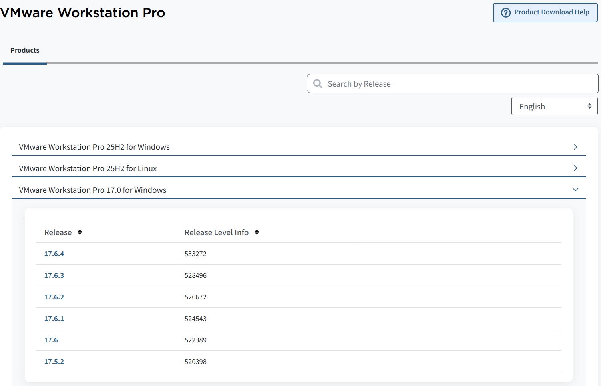

## 2. Download Ubuntu 22.04.3 image

Download Ubuntu 22.04.3 from
https://old-releases.ubuntu.com/releases/22.04.3/ubuntu-22.04.3-desktop-amd64.iso

## 3. Create a VM
1.Open VMware Workstation Pro software

2.Create a New Virtual Machine
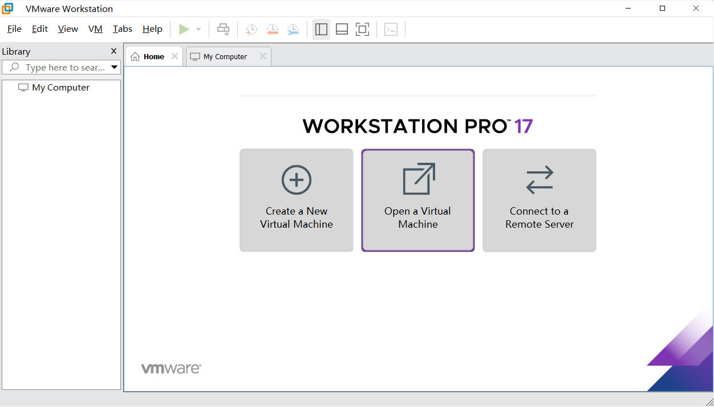

3.Select Custom(advanced)

4.Select Workstation 17.5 or later

5.Make sure your **Installer disc image file (iso)** ponits to the address your download as shown below:
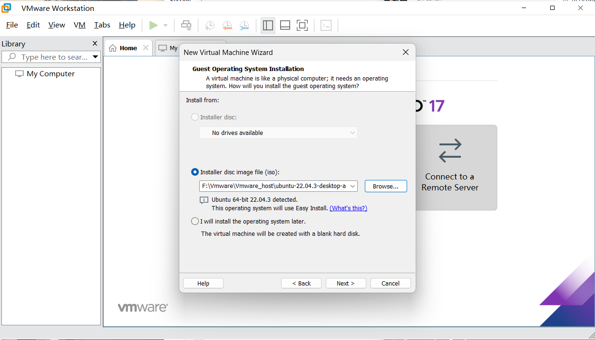

6.Type your name and password, We all set it to elec3607.
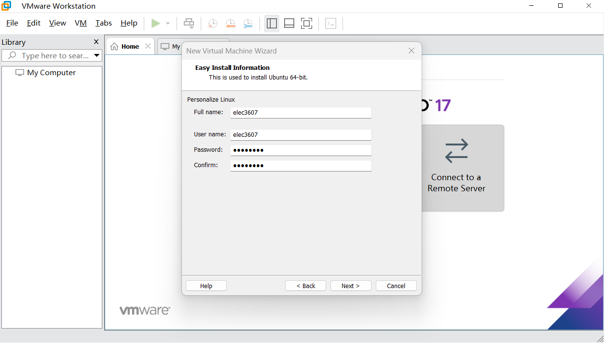

7.Set your processors and cores as shown below.
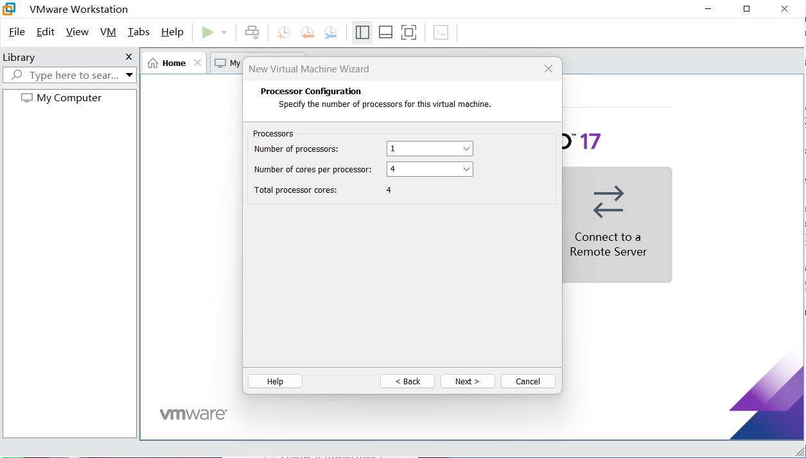

8.Set your memory to 8GB.
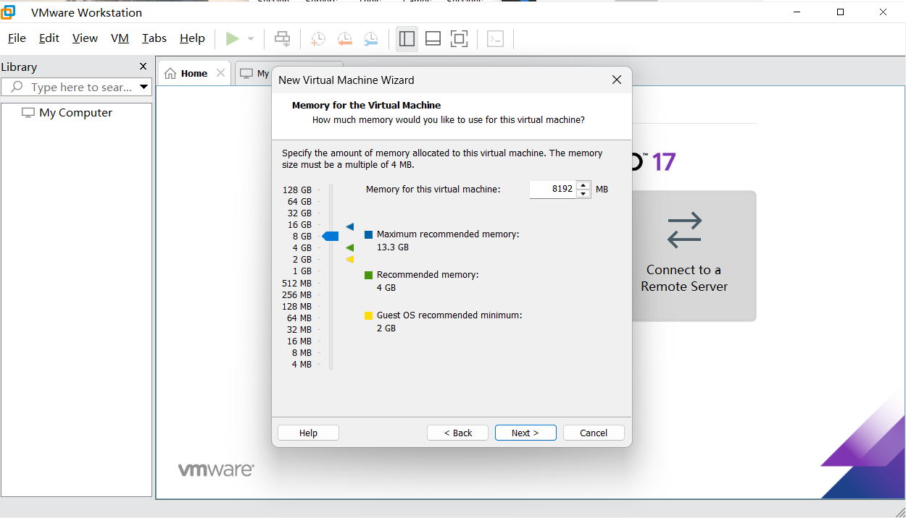

9.Select **Use network address translation (NAT)**.

10.Select **LSI Logic**.

11.Select **SCSI**.

12.Select **Create a new virtual disk**.

13.Allocate your disk capacity
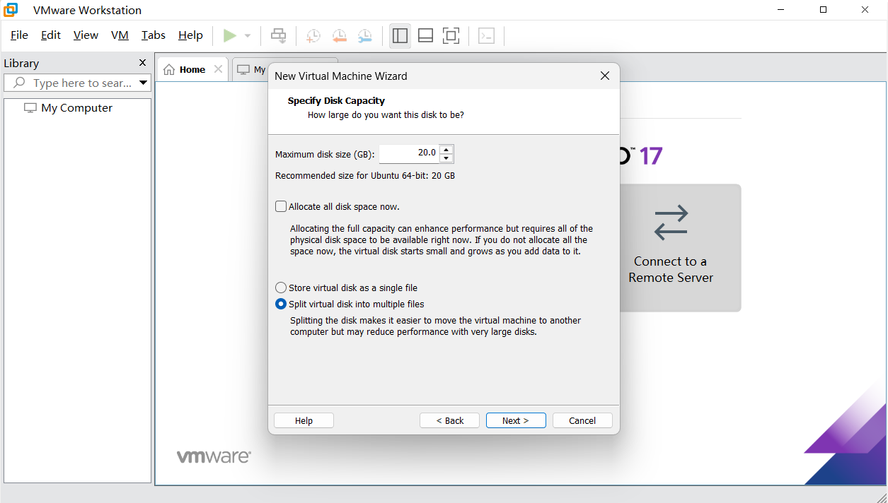


## 4. Start from Linux
Follow the instructions to install Ubuntu in VMware
Please note:
1. Please select **Erase disk and install Ubuntu**
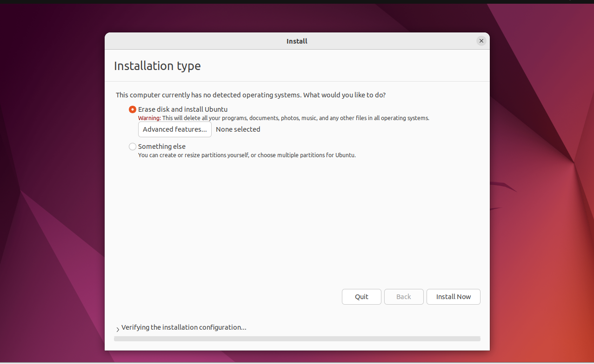

2. Set username and password to **elec3607**,(you can set your own username and password, but remember them)
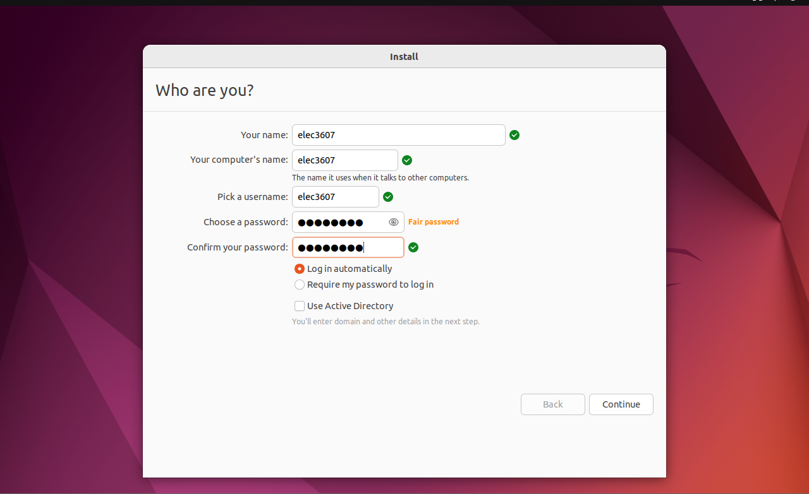

# Programming SD card
## 1. Preparation before Programming SD card
1.Insert the SD card reader into your computer's USB-A port.

2.Connect the SD card to the host machine first.
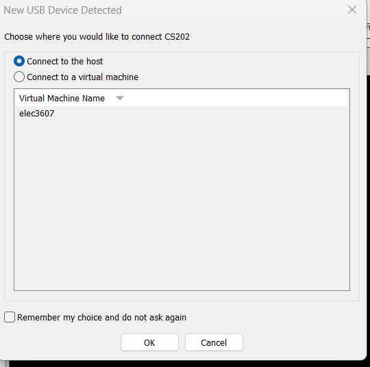

3.Go to **VM/Removable Devices/USB2.0 Device**, ensure **Connect(Disconnect from Host)** is enabled.
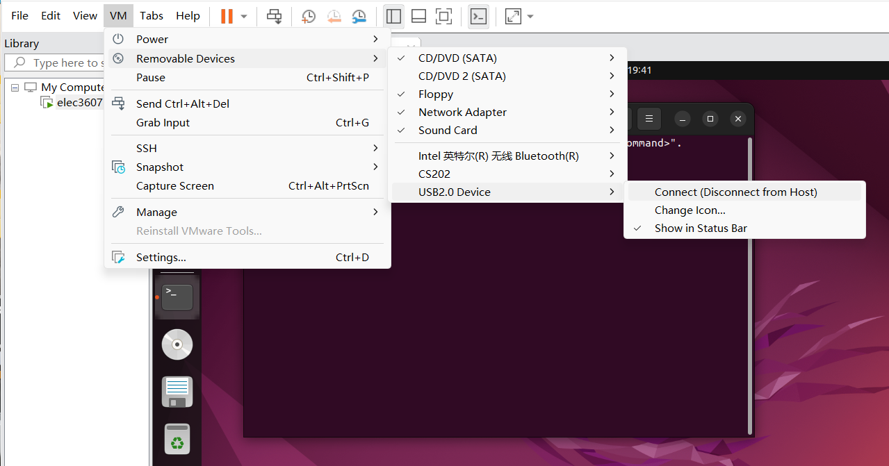

4.Open a terminal in elec3607 vm, run
```bash
lsblk
```
You should see a **sdb** is listed as shown below, sdb has a 14.4G for us to programme.
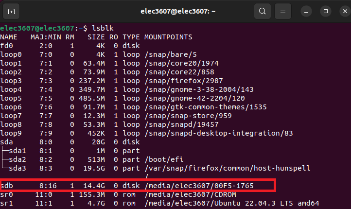

Unmount any automatically mounted partitions:

```bash
sudo umount /dev/sdb
```

If needed, wipe old signatures:
```bash
sudo wipefs -a /dev/sdb
```

---
## 2. Partition the micro-SD Card
To boot Linux from a micro-SD card, two partitions are required:

- **Partition 1**: FAT16 or FAT32, at least 100 MB (for boot files)
- **Partition 2**: ext4, occupies the remaining space (for root filesystem)

The Linux `gparted` utility is a convenient tool for this step.

Install and start `gparted`:

```bash
sudo apt install gparted -y
sudo gparted
```

In GParted:
1. Select the SD card device (e.g. `/dev/sdb`).
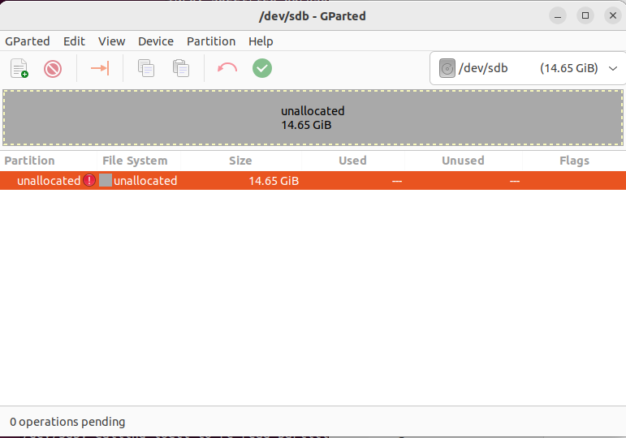
2. Go to **Device → Create Partition Table → msdos → Apply**.
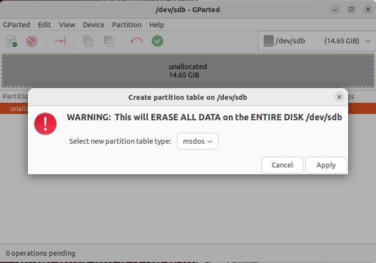
3. Create a new partition:
   - Type: **Primary**
   - File system: **FAT32**
   - Size: **100 MB or larger**
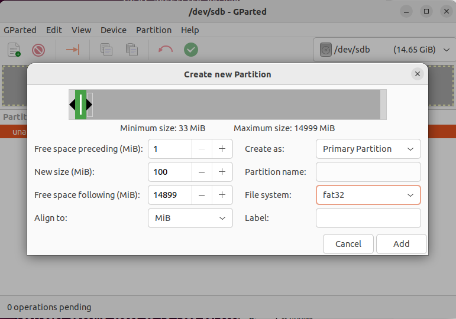
4. Create a second partition using the remaining space:
   - Type: **Primary**
   - File system: **ext4**
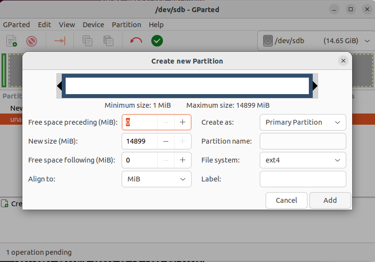
5. Click the **✓ (Apply)** button to confirm changes.
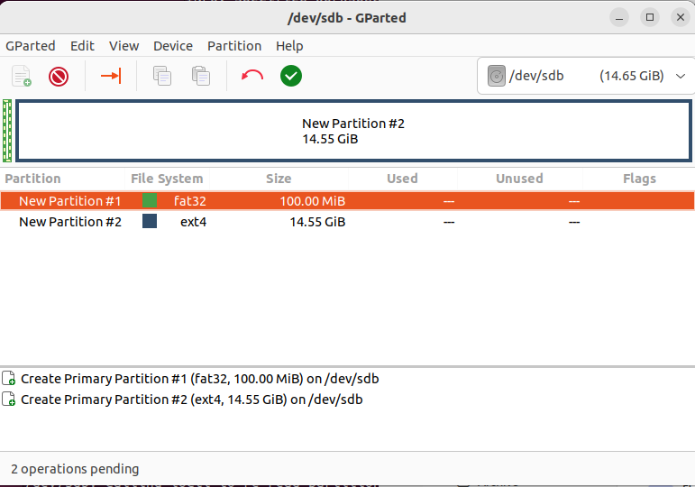


---

## 3. Mount the Boot Partition

Create a mount point and mount the first partition:

```bash
sudo mkdir -p /mnt/boot
sudo mount /dev/sdb1 /mnt/boot
```

---

## 4. Copy Boot Files
Download rootfs.ext4, BOOT.BIN, boot.scr, image.ub

Copy the following files from the PetaLinux build output to the first partition:

```bash
sudo cp BOOT.BIN /mnt/boot/
sudo cp boot.scr /mnt/boot/
sudo cp image.ub /mnt/boot/
```


---

## 5. Write the Root Filesystem

Use the `dd` utility to write the ext4 root filesystem to the second partition.

```bash
sudo dd if=rootfs.ext4 of=/dev/sdb2 bs=4M conv=fsync status=progress
```


---

## 6. Check and Resize the Filesystem

Run a filesystem check:

```bash
sudo e2fsck -fy /dev/sdb2
```

Then resize it to fill the partition:

```bash
sudo resize2fs /dev/sdb2
```

Example output:

```
resize2fs 1.46.5 (30-Dec-2021)
Resizing the filesystem on /dev/sdb2 to 15256576 (1k) blocks.
The filesystem on /dev/sdb2 is now 15256576 (1k) blocks long.
```

---

## 7. Verify the SD Card Contents

Check the partition file systems:

```bash
lsblk -f
```

Example output:

```
sdb
├─sdb1 vfat   FAT32       7DB8-584D  /mnt/boot
└─sdb2 ext4   1.0         9c2093d5-cb36-470c-96d0-8e938925e794
```

You can also mount both partitions to verify:
```bash
ls /mnt/boot
```

Expected files:

```
BOOT.BIN  boot.scr  image.ub
```
And
```bash
sudo mkdir -p /mnt/rootfs
sudo mount /dev/sdb2 /mnt/rootfs
ls /mnt/rootfs
```

Expected directories:

```
bin  boot  dev  etc  home  lib  media  mnt  proc  run  sbin  srv  sys  tmp  usr  var
```

Finally, unmount and eject the SD card:

```bash
sudo umount /mnt/boot
sudo umount /mnt/rootfs
sudo eject /dev/sdb
```

# Boot from Petalinux


## 1. Preparation

Before powering on the board, ensure that:

1. The **micro-SD card** (prepared earlier with `BOOT.BIN`, `boot.scr`, `image.ub`, and `rootfs.ext4`) is inserted into the board’s SD slot.  
2. The **JTAG / SD switch** on the board is set to **SD** mode.  
3. Connect the PROG-UART interface of the AUP-ZU3 board to the host PC via a USB-C cable.

If you see the **DONE** LED light turn on after powering on the board, congratulations — you have successfully booted the board!


Reboot the board and make sure **VM/Devices/Future Devices JTAG+Serial** is connect to VM not host.

---

## 2. Load FTDI Serial Drivers on Host (Ubuntu)

Check whether the FTDI driver module is already loaded:

```bash
lsmod | grep ftdi_sio
```

If there is no output, load the required kernel modules manually:

```bash
sudo modprobe ftdi_sio
sudo modprobe usbserial
```

Verify that the modules are loaded:

```bash
lsmod | grep ftdi_sio
```

Expected output:
```
ftdi_sio               69632  0
usbserial              69632  1 ftdi_sio
```

---

## 3. Check USB Connection

List all connected USB devices to confirm detection of the FTDI dual-UART interface:

```bash
lsusb
```

Example output:
```
Bus 001 Device 020: ID 0403:6010 Future Technology Devices International, Ltd FT2232C/D/H Dual UART/FIFO IC
```

List the detected serial ports:

```bash
ls /dev/ttyUSB*
```

Expected output:
```
/dev/ttyUSB0  /dev/ttyUSB1

```
---

## 4. Open Serial Terminal

Install the `minicom` terminal utility (if not already installed):

```bash
sudo apt install minicom
```
In the AUP-ZU3 and most Zynq / Zynq UltraScale+ MPSoC-based development boards, the UART console typically operates at a default baud rate of 115200.
Open a serial console session (use ttyUSB1, which is usually connected to the main Linux UART output):

```bash
sudo minicom -D /dev/ttyUSB1 -b 115200
```

---

## 5. Power On and Boot Linux

1. With `minicom` running, press the **POR** (Power-On Reset) button on the AUP-ZU3 board.  
2. The boot messages from PetaLinux will appear in the terminal.  
3. Wait until the login prompt appears.

Example output:
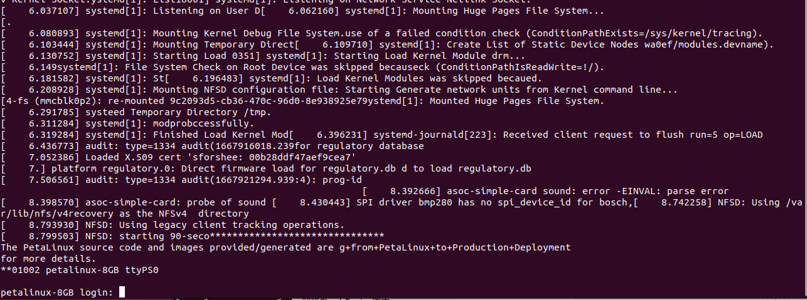

---

## 6. Login to Petalinux

Use the default login credentials:

- **Username:** `petalinux` (you can also use any other username you like) 
- On the first login, the system will prompt you to create a **new password** for future logins.

Once completed, you will have access to the Petalinux shell on the AUP-ZU3 board.


## Important components on the AUP-ZU3 (marked in red):

