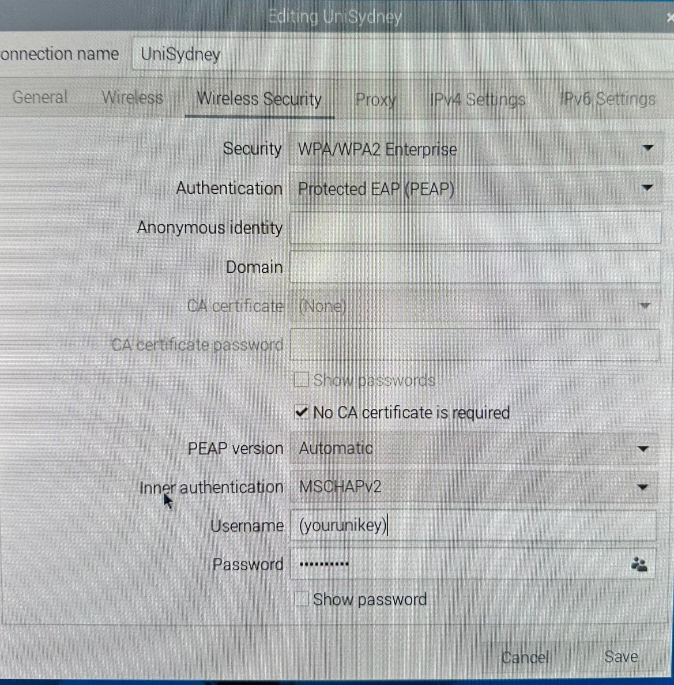
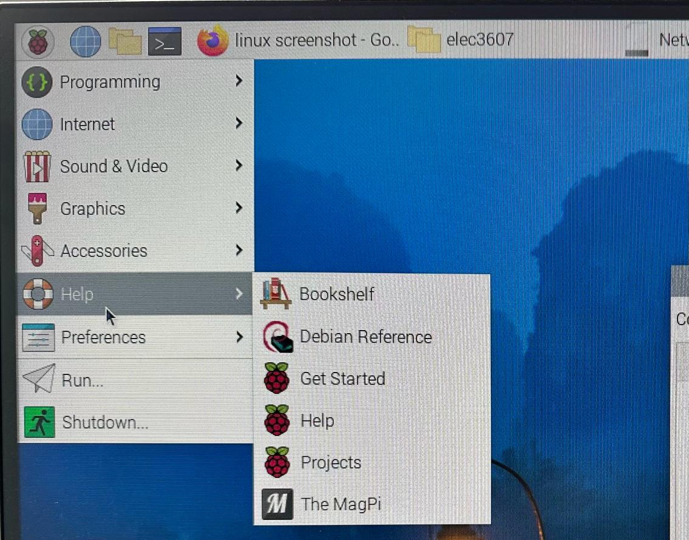

# Installation
This is a lab to set up your Raspberry Pi for ELEC3607.

1. Download and run the Raspberry Pi imager from <https://www.raspberrypi.com/software/>. 
2. Create Raspberry Pi Image (the one on the uSD card is probably an old one)
    - Select Device="Raspberry Pi 4", Operating System="Raspberry Pi OS (64-bit)", and Storage=<your card> (a 16GB or larger uSD). 
    - Edit OS customisation settings.  Set username and password (I set mine to "elec3607" and "elec3607") and in the Services tab, select Enable SSH (Use password authentication). 
    - Apply the customisation settings and write the image. 

2. Configure Network.
    - Boot the RPi using an external keyboard, mouse and monitor connected to your RPi. 

    - Configure your wireless network. At the University of Sydney, the settings are: Wi-Fi security="WPA & WPA2 Enterprise", Authentication="Protected EAP (PEAP), select No CA certificate is required, Username=(your unikey) and Password=(your USyd password).



    - Find your IP address. In the example below, on wlan0 next to inet 
    you can see it is 10.17.127.125.

```bash
elec3607@raspberrypi:~ $ ifconfig
eth0: flags=4099<UP,BROADCAST,MULTICAST>  mtu 1500
        ether e4:5f:01:45:68:ae  txqueuelen 1000  (Ethernet)
        RX packets 0  bytes 0 (0.0 B)
        RX errors 0  dropped 0  overruns 0  frame 0
        TX packets 0  bytes 0 (0.0 B)
        TX errors 0  dropped 0 overruns 0  carrier 0  collisions 0

lo: flags=73<UP,LOOPBACK,RUNNING>  mtu 65536
        inet 127.0.0.1  netmask 255.0.0.0
        inet6 ::1  prefixlen 128  scopeid 0x10<host>
        loop  txqueuelen 1000  (Local Loopback)
        RX packets 20  bytes 2318 (2.2 KiB)
        RX errors 0  dropped 0  overruns 0  frame 0
        TX packets 20  bytes 2318 (2.2 KiB)
        TX errors 0  dropped 0 overruns 0  carrier 0  collisions 0

wlan0: flags=4163<UP,BROADCAST,RUNNING,MULTICAST>  mtu 1500
        inet 10.17.127.125  netmask 255.255.252.0  broadcast 10.17.127.255
        inet6 fe80::6909:3882:386c:f05a  prefixlen 64  scopeid 0x20<link>
        ether e4:5f:01:45:68:af  txqueuelen 1000  (Ethernet)
        RX packets 134384  bytes 168076238 (160.2 MiB)
        RX errors 0  dropped 0  overruns 0  frame 0
        TX packets 49893  bytes 4941145 (4.7 MiB)
        TX errors 0  dropped 0 overruns 0  carrier 0  collisions 0
```

3. Update and upgrade the distribution
```bash
# update the list of packages available
elec3607@raspberrypi:~ $ sudo apt update
Get:1 http://deb.debian.org/debian bookworm InRelease [151 kB]
Get:2 http://deb.debian.org/debian-security bookworm-security InRelease [48.0 kB]
Get:3 http://deb.debian.org/debian bookworm-updates InRelease [52.1 kB]
Get:4 http://archive.raspberrypi.com/debian bookworm InRelease [23.6 kB]
Get:5 http://deb.debian.org/debian bookworm/main arm64 Packages [8,685 kB]
Get:6 http://archive.raspberrypi.com/debian bookworm/main armhf Packages [362 kB]
Get:7 http://deb.debian.org/debian bookworm/main armhf Packages [8,498 kB]
Get:8 http://archive.raspberrypi.com/debian bookworm/main arm64 Packages [353 kB]
Get:9 http://deb.debian.org/debian bookworm/main Translation-en [6,109 kB]     
Get:10 http://deb.debian.org/debian-security bookworm-security/main armhf Packages [132 kB]
Get:11 http://deb.debian.org/debian-security bookworm-security/main arm64 Packages [135 kB]
Get:12 http://deb.debian.org/debian-security bookworm-security/main Translation-en [81.6 kB]
Get:13 http://deb.debian.org/debian bookworm-updates/main armhf Packages [12.1 kB]
Get:14 http://deb.debian.org/debian bookworm-updates/main arm64 Packages [12.5 kB]
Get:15 http://deb.debian.org/debian bookworm-updates/main Translation-en [13.8 kB]
Fetched 24.7 MB in 11s (2,246 kB/s)                                            
Reading package lists... Done
Building dependency tree... Done
Reading state information... Done
54 packages can be upgraded. Run 'apt list --upgradable' to see them.
N: Repository 'http://deb.debian.org/debian bookworm InRelease' changed its 'Version' value from '12.4' to '12.5'

# list the free disk space
elec3607@raspberrypi:~ $ df
Filesystem     1K-blocks    Used Available Use% Mounted on
udev             1672436       0   1672436   0% /dev
tmpfs             388432    1192    387240   1% /run
/dev/mmcblk0p2   7072624 1828000   4865552  28% /
tmpfs            1942144       0   1942144   0% /dev/shm
tmpfs               5120      16      5104   1% /run/lock
/dev/mmcblk0p1    522232   63056    459176  13% /boot/firmware
tmpfs             388428       0    388428   0% /run/user/1000

# upgrade the distribution
elec3607@raspberrypi:~ $ sudo apt upgrade
Reading package lists... Done
Building dependency tree... Done
Reading state information... Done
Calculating upgrade... Done
The following NEW packages will be installed:
  linux-headers-6.1.0-rpi8-common-rpi linux-headers-6.1.0-rpi8-rpi-2712
  linux-headers-6.1.0-rpi8-rpi-v8 linux-image-6.1.0-rpi8-rpi-2712
  linux-image-6.1.0-rpi8-rpi-v8
The following packages will be upgraded:
  base-files bluez curl firmware-atheros firmware-brcm80211 firmware-libertas
  firmware-misc-nonfree firmware-realtek kms++-utils libbluetooth3 libc-bin
  libc-dev-bin libc-devtools libc-l10n libc6 libc6-dbg libc6-dev
  libcamera-apps-lite libcryptsetup12 libcurl3-gnutls libcurl4 libde265-0
  libgnutls30 libisl23 libkms++0 libpam-systemd libsystemd-shared libsystemd0
  libudev1 linux-headers-rpi-2712 linux-headers-rpi-v8 linux-image-rpi-2712
  linux-image-rpi-v8 linux-kbuild-6.1 linux-libc-dev locales openssh-client
  openssh-server openssh-sftp-server raspberrypi-net-mods raspberrypi-sys-mods
  raspi-config raspi-firmware rpi-eeprom rpicam-apps-lite ssh systemd
  systemd-sysv systemd-timesyncd tar tzdata udev usbutils usrmerge
54 upgraded, 5 newly installed, 0 to remove and 0 not upgraded.
Need to get 177 MB of archives.
After this operation, 135 MB of additional disk space will be used.
Do you want to continue? [Y/n] 
Get:1 http://deb.debian.org/debian bookworm/main arm64 base-files arm64 12.4+deb12u5 [70.8 kB]
...
update-initramfs: Generating /boot/initrd.img-6.1.0-rpi8-rpi-v8
'/boot/initrd.img-6.1.0-rpi8-rpi-v8' -> '/boot/firmware/initramfs8'
update-initramfs: Generating /boot/initrd.img-6.1.0-rpi8-rpi-2712
'/boot/initrd.img-6.1.0-rpi8-rpi-2712' -> '/boot/firmware/initramfs_2712'
update-initramfs: Generating /boot/initrd.img-6.1.0-rpi7-rpi-v8
update-initramfs: Generating /boot/initrd.img-6.1.0-rpi7-rpi-2712
```

4. Linux References and Things to Learn
    - Command line cheat sheet <https://bootlin.com/doc/legacy/command-line/command_memento.pdf>
    - Comprehensive help for Linux is available here:

    - If you have not used Linux before, read this tutorial: <https://ubuntu.com/tutorials/command-line-for-beginners>
    - Before next week, if you are not familiar with a Linux editor I recommend learning Vim: <https://www.linux.com/training-tutorials/vim-101-beginners-guide-vim/>
    
5. SSH (Patrick Gaft)
While you can complete all the lab work directly on the Raspberry Pi using the lab's peripherals, you may find it useful to connect via SSH from your own computer. This allows you to transfer data and execute commands on the Raspberry Pi remotely.

To connect via SSH:

    * Find the Raspberry Pi's IP address (as done earlier)

    * Open Command Prompt/PowerShell (Windows) or Terminal (Mac/Linux) on your computer.

    * Enter the following command, replacing the placeholders:
    ```bash
    $ ssh elec3607@123.124.125.126
    ```

      "elec3607" would be replaced with the username you set for the Raspberry Pi in lab 0 and "123.124.125.126" would be replaced with the IP address you found in step 1.

    * You will be prompted to enter the password of the Raspberry Pi. Once entered correctly you should be connected to the Raspberry Pi.

    A quick test you can do is the following:
    ```bash
     # run the following command on your computer:
     $ echo "Hello World!" > hello.txt
     # on the Raspberry Pi, you should now be able to see the file with:
     $ ls
     # you can also try:
     $ cat hello.txt
    ```


    * If you forgot to enable SSH:

    When you created the Raspberry Pi image you may have forgotten to enable SSH, if this is the case you can find various methods to enable it in the Raspberry Pi documentation (learning to read documentation will be a very useful skill for this course!).

