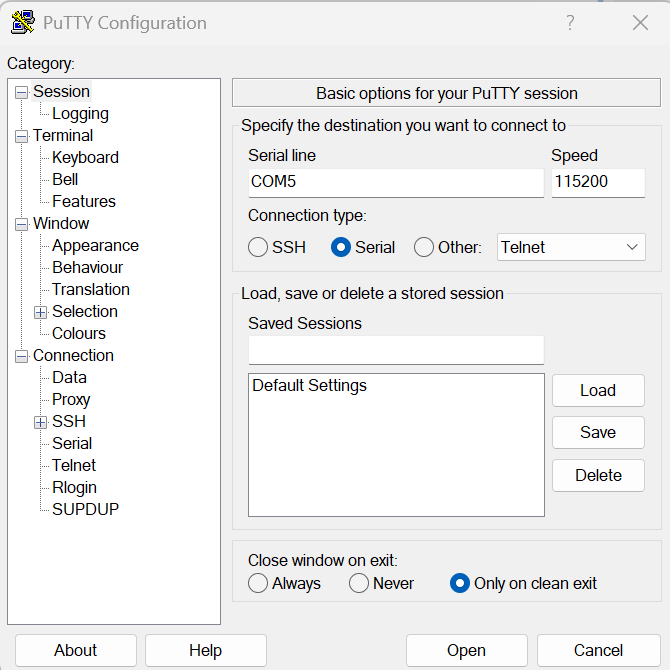

This is a lab to set up your AUP-ZU3 board for ELEC3607.

---
# Programming SD card
First we write a Petalinux image to an SD card using Balena Etcher.

1. Install [Balena Etcher](https://etcher.balena.io/#download-etcher) on your machine. This is a cross-platform (Windows, Mac, and Linux) app to write images to an SD card or flash drive.
1. Download **petalinux-sdimage.wic** image from [here]() and burn the image to your card.

# Boot from Petalinux


## 1. Preparation

Before powering on the board, ensure that:

1. The **micro-SD card** is inserted into the board’s SD slot.  
2. The **JTAG / SD switch** on the board is set to **SD** mode.  
3. Connect the PROG-UART interface of the AUP-ZU3 board to the host PC via a USB-C cable.

If you see the **DONE** LED light turn on after powering on the board, congratulations — you have successfully booted the board!

## 2. Set username and password
For Windows users, you can first open Device Manager. You should see two **USB Serial Ports** under the **ports** section.

```bash
USB Serial Port(COM5)
USB Serial Port(COM6)
```

Download putty frpm https://www.chiark.greenend.org.uk/~sgtatham/putty/latest.html and install it.

Open the software and adjust it to the configuration shown in the image below (please note that not every computer's serial line is COM5; you need to check the Port in Device Manager, but the speed is always 115200).


Click Open and reboot AUP-ZU3. You should see the following final output in the dialog box.

The user name is always **petalinux**, set your own password.


## 3. Using SSH
Run
```bash
ifconfig
```
The output image is shown below. We can see that the Ethernet address is 10.70.152.58.

Since the AUP-ZU3 does not have built-in wireless networking, the most convenient way for Windows users to operate the AUP-ZU3 is to use a SSH client (such as [MobaXterm](https://mobaxterm.mobatek.net/)) to access the board via its Ethernet IP address.

