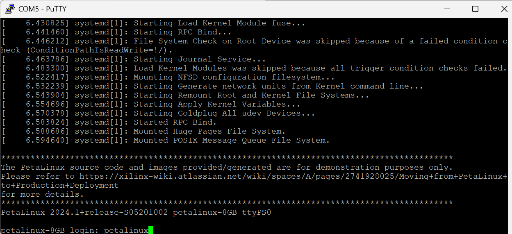
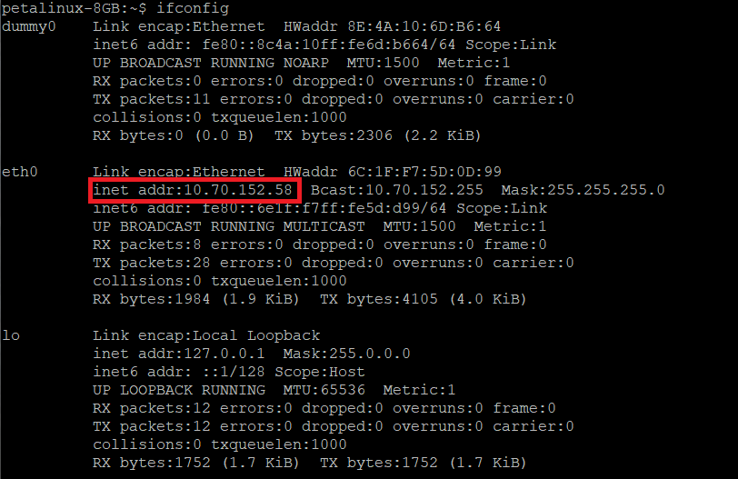

This is a lab to set up your AUP-ZU3 board for ELEC3607.

---
# Programming SD card
First we write a Petalinux image to an SD card using Balena Etcher.

1. Install [Balena Etcher](https://etcher.balena.io/#download-etcher) on your machine. This is a cross-platform (Windows, Mac, and Linux) app to write images to an SD card or flash drive.
1. Download <https://unisyd-my.sharepoint.com/:u:/g/personal/philip_leong_sydney_edu_au/IQAUtXX_MOIaSYis3LzJQqP-AcDkhgrgWxwWOionJHcdzEs?e=c0ypls>, unzip and and burn the image to your card iusing Etcher.

# Boot from Petalinux


## 1. Preparation

Before powering on the board, ensure that:

1. The **micro-SD card** is inserted into the board’s SD slot.  
2. The **JTAG / SD switch** on the board is set to **SD** mode.  
3. Connect the PROG-UART interface of the AUP-ZU3 board to the host PC via a USB-C cable.

If you see the **DONE** LED light turn on after powering on the board, congratulations — you have successfully booted the board!

## 2. Connection to Board
It will be useful to connect to the board in two ways: 
* via a serial port which will allow you to login to the board and type commands
* via Ethernet, enabling the connection of the board to the Internet.

### 2.1 Windows
### 2.1.1 Serial Port (UART)
For Windows users, you can first open Device Manager. You should see two **USB Serial Ports** under the **ports** section.

```bash
USB Serial Port(COM5)
USB Serial Port(COM6)
```

Download putty frpm https://www.chiark.greenend.org.uk/~sgtatham/putty/latest.html and install it.

Open the software and adjust it to the configuration shown in the image below (please note that not every computer's serial line is COM5; you need to check the Port in Device Manager, but the speed is always 115200).


Click Open and reboot the AUP-ZU3 by pressing the "POR" button. You should see the following final output in the dialog box.

The user name is **petalinux**, set your own password using the ```passwd''' command.


### 2.1.2. Network (via Ethernet)
Run
```bash
$ ifconfig
```
The output image is shown below. We can see that the Ethernet address is 10.70.152.58.

Since the AUP-ZU3 does not have built-in wireless networking, the most convenient way for Windows users to operate the AUP-ZU3 is to use a SSH client (such as [MobaXterm](https://mobaxterm.mobatek.net/)) to access the board via its Ethernet IP address.

### 2.2 MacOS
### 2.2.1 Serial Port (UART)
First identify the serial port used for connection to the AUP-ZU3
```bash
# ls /dev/tty.usb*
/dev/tty.usbserial-8802250000120
/dev/tty.usbserial-8802250000121
```
The above shows two serial ports and the one actually connected to the AUP-ZU3 is ```/dev/tty.usbserial-8802250000121``` (you can confirm by disconnecting the USB cable and the device should disappear).

The program screen(1) allows connections between a MacOS machine and 
a serial port. It does the equivalent thing to Putty under windows. As with any
command-line program, you can get the manual entry via
```bash
$ man screen

SCREEN(1)                    General Commands Manual                    SCREEN(1)

NAME
       screen - screen manager with VT100/ANSI terminal emulation

SYNOPSIS
       screen [ -options ] [ cmd [ args ] ]
       screen -r [[pid.]tty[.host]]
       screen -r sessionowner/[[pid.]tty[.host]]

DESCRIPTION
       Screen is a full-screen window manager that multiplexes a physical
       terminal between several processes (typically interactive shells).  Each
       virtual terminal provides the functions of a DEC VT100 terminal and, in
       addition, several control functions from the ISO 6429 (ECMA 48, ANSI
       X3.64) and ISO 2022 standards (e.g. insert/delete line and support for
       multiple character sets).  There is a scrollback history buffer for each
       virtual terminal and a copy-and-paste mechanism that allows moving text
       regions between windows.

...
```
In particular, the way to kill all windows and terminate screen(1) is with C-a C-\\ (control-A control-\\).

Connect to the serial port and hit Return a few times to find
the login prompt:
```
$ screen /dev/tty.usbserial-8802250000121 115200

petalinux-8GB login: 
```
The user name is **petalinux**, set your own password using the ```passwd''' command.

### 2.2.2. Network (via Ethernet)
Plug the ethernet into the network and get the IP address using the ```ipconfig``` command

```bash
$ ifconfig
...

eth0      Link encap:Ethernet  HWaddr C8:4D:44:27:B4:36  
          inet addr:10.70.152.58  Bcast:10.70.152.255  Mask:255.255.255.0
          inet6 addr: fe80::ca4d:44ff:fe27:b436/64 Scope:Link
          UP BROADCAST RUNNING MULTICAST  MTU:1500  Metric:1
          RX packets:140 errors:0 dropped:0 overruns:0 frame:0
          TX packets:44 errors:0 dropped:0 overruns:0 carrier:0
          collisions:0 txqueuelen:1000 
          RX bytes:9784 (9.5 KiB)  TX bytes:6761 (6.6 KiB)
...
```

In the example above, the address is ```10.70.152.58```. 

## 3. Login via SSH and Retrieve Repository
Connect to the machine via ethernet (from another terminal window on you MacOS machine), login and clone the ELEC3607 lab repository:
```bash
$ ssh petalinux@10.70.152.58
petalinux@10.70.152.58's password: 
Last login: Tue Nov  8 18:44:22 2022

petalinux-8GB:~$ git clone https://github.com/phwl/elec3607-lab.git
Cloning into 'elec3607-lab'...
remote: Enumerating objects: 1542, done.
remote: Counting objects: 100% (171/171), done.
remote: Compressing objects: 100% (124/124), done.
remote: Total 1542 (delta 53), reused 156 (delta 44), pack-reused 1371 (from 2)
Receiving objects: 100% (1542/1542), 116.38 MiB | 12.51 MiB/s, done.
Resolving deltas: 100% (828/828), done.
Updating files: 100% (250/250), done.
```
```

