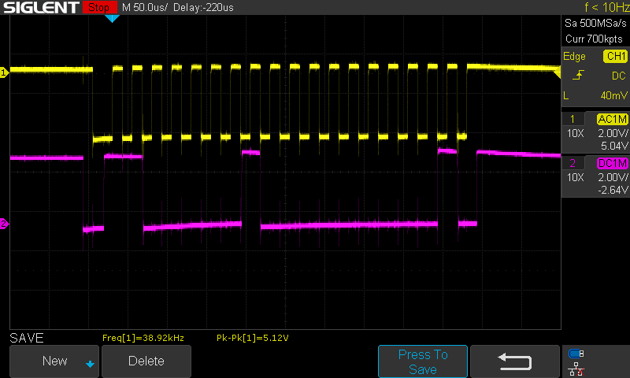

# Lab 2 - Si5351

This lab involves soldering the components for the Si5351 on the ELEC3607-SDRv2 printed circuit board and programming it to test your handiwork. 

## 1. Soldering (Week 1 - 100%)
Identify the missing components on the printed circuit board (PCB) that are required for the Si5351. You will need to study the PCB and the schematic diagram to understand what they do. Find the data sheets for the components and identify the orientation that they should be placed. Write all of this information in your lab book (including where to find the data sheet).

Solder the remaining components to your PCB. Think about how to test that they have been soldered correctly and are working properly using only a multimeter and oscilloscope. Write your testing methodology and results in your lab book including screen shots of key measurements. Also explain in your lab book
why for embedded systems you should mostly use your oscilloscope probes in x10 mode.

## 2. Si5351 Programming (Week 2)
### 2.1 Raspberry Pi Configuration
First you need to enable the RPi i2c port. You do this by running
```raspi-config```, select ```Interface Options``` and then 
select ```I2C```. This loads the i2c driver into the kernel.

To check that worked, try:
```bash
elec3607@raspberrypi:~ $ i2cdetect -l
i2c-1	i2c       	bcm2835 (i2c@7e804000)          	I2C adapter
i2c-20	i2c       	fef04500.i2c                    	I2C adapter
i2c-21	i2c       	fef09500.i2c                    	I2C adapter
```
This tells us that the i2c-1 device is found (the part that says ```bcm2835 (i2c@7e804000)``` doesn't appear to be accurate).


Now scan i2c bus 1 for any i2c devices:
```bash
elec3607@raspberrypi:~ $ i2cdetect 1
WARNING! This program can confuse your I2C bus, cause data loss and worse!
I will probe file /dev/i2c-1.
I will probe address range 0x08-0x77.
Continue? [Y/n] 
     0  1  2  3  4  5  6  7  8  9  a  b  c  d  e  f
00:                         -- -- -- -- -- -- -- -- 
10: -- -- -- -- -- -- -- -- -- -- -- -- -- -- -- -- 
20: -- -- -- -- -- -- -- -- -- -- -- -- -- -- -- -- 
30: -- -- -- -- -- -- -- -- -- -- -- -- -- -- -- -- 
40: -- -- -- -- -- -- -- -- -- -- -- -- -- -- -- -- 
50: -- -- -- -- -- -- -- -- -- -- -- -- -- -- -- -- 
60: 60 -- -- -- -- -- -- -- -- -- -- -- -- -- -- -- 
```
This tells us that the only device that responded was the one at address 0x60 (which happens to be the si5351 chip).

### 2.2 I2C Interface to Si5351

The i2c interface is simple. First study the SDR board and connect the power, SDA and SCL lines of the from the RPi to the appropriate port on the SDR board. 

Here is part of the i2c transaction for i2cdetect -y 1 0x60 0x60.



### 2.3 Linux userspace driver

```bash
elec3607@raspberrypi:~/elec3607-lab/labs/lab2-i2c $ sudo apt install libi2c-dev
Reading package lists... Done
Building dependency tree... Done
Reading state information... Done
The following package was automatically installed and is no longer required:
  libraspberrypi0
Use 'sudo apt autoremove' to remove it.
The following NEW packages will be installed:
  libi2c-dev
0 upgraded, 1 newly installed, 0 to remove and 73 not upgraded.
Need to get 11.6 kB of archives.
After this operation, 35.8 kB of additional disk space will be used.
Get:1 http://deb.debian.org/debian bookworm/main arm64 libi2c-dev arm64 4.3-2+b3 [11.6 kB]
Fetched 11.6 kB in 1s (11.9 kB/s)    
Selecting previously unselected package libi2c-dev:arm64.
(Reading database ... 145281 files and directories currently installed.)
Preparing to unpack .../libi2c-dev_4.3-2+b3_arm64.deb ...
Unpacking libi2c-dev:arm64 (4.3-2+b3) ...
Setting up libi2c-dev:arm64 (4.3-2+b3) ...
```

There are several ways that this interface can be made. We are going to create a Linux i2c-dev userspace driver, which is the most straightforward. The following program, derived from the Linux Kernel userspace driver documentation

The program ```i2cread.c``` reads and prints register 0 of device /dev/i2c-1, address 0x60, i.e. register 0 of the Si5351. Note there could be multiple devices connected to a single i2c chip.

```C
#include <stdio.h>
#include <stdlib.h>
#include <fcntl.h>
#include <sys/ioctl.h>
#include <linux/i2c-dev.h>
#include <i2c/smbus.h>

#define	I2C_FNAME	"/dev/i2c-1"
#define	SI5351_ADDR	0x60

int	i2c_file;

void i2c_init()
{
	i2c_file = open(I2C_FNAME, O_RDWR);
	if (i2c_file < 0)
		exit(1);
}

int i2c_read(unsigned char reg)
{
	if (ioctl(i2c_file, I2C_SLAVE, SI5351_ADDR) < 0) 
		exit(1);

	int res;

	/* Using SMBus commands */
	res = i2c_smbus_read_byte_data(i2c_file, reg);
	if (res < 0) 
		exit(1);
	else 
		printf("r dev(0x%x) reg(0x%x)=0x%x\n", SI5351_ADDR, reg, res);
	return res;
}

int
main()
{
	i2c_init();
	i2c_read(0);
}
```

It can be compiled and executed as follows:
```bash
elec3607@raspberrypi:~/elec3607-lab/labs/lab2-i2c $ make
cc    -c -o i2cread.o i2cread.c
cc -o i2cread i2cread.o -li2c
elec3607@raspberrypi:~/elec3607-lab/labs/lab2-i2c $ ./i2cread
r dev(0x60) reg(0x0)=0x11 (decimal 17)
```

### 2.4 Programming the Clock Generator

[The data sheet](https://www.skyworksinc.com/-/media/Skyworks/SL/documents/public/data-sheets/Si5351-B.pdf)
for the Si5351 refers to the 
[Clock builder pro software](https://www.skyworksinc.com/en/Application-Pages/Clockbuilder-Pro-Software). This is only available for Windows but in embedded systems it is a fact of life that if you use operating system X, there will be a piece of software that is only supported on operating system Y that you need. Here is a header file that I generated for CLK0 and CLK1 outputs of 28.1544 MHz.

```C
/*
 * Si5351A Rev B Configuration Register Export Header File
 *
 * This file represents a series of Silicon Labs Si5351A Rev B 
 * register writes that can be performed to load a single configuration 
 * on a device. It was created by a Silicon Labs ClockBuilder Pro
 * export tool.
 *
 * Part:		                                       Si5351A Rev B
 * Design ID:                                          
 * Includes Pre/Post Download Control Register Writes: Yes
 * Created By:                                         ClockBuilder Pro v3.1 [2021-01-18]
 * Timestamp:                                          2021-03-12 15:00:15 GMT-08:00
 *
 * A complete design report corresponding to this export is included at the end 
 * of this header file.
 *
 */

#ifndef SI5351A_REVB_REG_CONFIG_HEADER
#define SI5351A_REVB_REG_CONFIG_HEADER

#define SI5351A_REVB_REG_CONFIG_NUM_REGS				52

typedef struct
{
	unsigned int address; /* 16-bit register address */
	unsigned char value; /* 8-bit register data */

} si5351a_revb_register_t;

si5351a_revb_register_t const si5351a_revb_registers[SI5351A_REVB_REG_CONFIG_NUM_REGS] =
{
	{ 0x0002, 0x53 },
	{ 0x0003, 0x00 },
	{ 0x0004, 0x20 },
	{ 0x0007, 0x00 },
	{ 0x000F, 0x00 },
	{ 0x0010, 0x0F },
	{ 0x0011, 0x0F },
	{ 0x0012, 0x8C },
	{ 0x0013, 0x8C },
	{ 0x0014, 0x8C },
	{ 0x0015, 0x8C },
	{ 0x0016, 0x8C },
	{ 0x0017, 0x8C },
	{ 0x001A, 0xAF },
	{ 0x001B, 0xC8 },
	{ 0x001C, 0x00 },
	{ 0x001D, 0x0E },
	{ 0x001E, 0x8D },
	{ 0x001F, 0x00 },
	{ 0x0020, 0x85 },
	{ 0x0021, 0x58 },
	{ 0x002A, 0x00 },
	{ 0x002B, 0x04 },
	{ 0x002C, 0x00 },
	{ 0x002D, 0x0D },
	{ 0x002E, 0xE0 },
	{ 0x002F, 0x00 },
	{ 0x0030, 0x00 },
	{ 0x0031, 0x00 },
	{ 0x0032, 0x00 },
	{ 0x0033, 0x04 },
	{ 0x0034, 0x00 },
	{ 0x0035, 0x0D },
	{ 0x0036, 0xE0 },
	{ 0x0037, 0x00 },
	{ 0x0038, 0x00 },
	{ 0x0039, 0x00 },
	{ 0x005A, 0x00 },
	{ 0x005B, 0x00 },
	{ 0x0095, 0x00 },
	{ 0x0096, 0x00 },
	{ 0x0097, 0x00 },
	{ 0x0098, 0x00 },
	{ 0x0099, 0x00 },
	{ 0x009A, 0x00 },
	{ 0x009B, 0x00 },
	{ 0x00A2, 0x00 },
	{ 0x00A3, 0x00 },
	{ 0x00A4, 0x00 },
	{ 0x00A5, 0x00 },
	{ 0x00A6, 0x00 },
	{ 0x00B7, 0x92 },

};

/*
 * Design Report
 *
 * Overview
 * ========
 * Part:               Si5351A
 * Created By:         ClockBuilder Pro v3.1 [2021-01-18]
 * Timestamp:          2021-03-12 15:00:15 GMT-08:00
 * 
 * Design Notes
 * ============
 * Si5351A 10-pin MSOP
 * 
 * Design Rule Check
 * =================
 * Errors:
 * - No errors
 * 
 * Warnings:
 * - No warnings
 * 
 * Design
 * ======
 * Inputs:
 *     IN0: 27 MHz
 * 
 * Outputs:
 *    OUT0: 28.1544 MHz
 *          Enabled LVCMOS 8 mA
 *          Offset 0.000 s 
 *    OUT1: 28.1544 MHz
 *          Enabled LVCMOS 8 mA
 *          Offset 0.000 s 
 *    OUT2: Unused
 * 
 * Frequency Plan
 * ==============
 * PLL_A:
 *    Enabled Features = None
 *    Fvco             = 893.9022 MHz
 *    M                = 33.1074888888888888... [ 33 + 4837/45000 ]
 *    Input0:
 *       Source           = Crystal
 *       Source Frequency = 27 MHz
 *       Fpfd             = 27 MHz
 *       Load Capacitance = Load_08pF
 *    Output0:
 *       Features       = None
 *       Disabled State = StopLow
 *       R              = 1  (2^0)
 *       Fout           = 28.1544 MHz
 *       N              = 31.75
 *    Output1:
 *       Features       = None
 *       Disabled State = StopLow
 *       R              = 1  (2^0)
 *       Fout           = 28.1544 MHz
 *       N              = 31.75
 * 
 * Settings
 * ========
 * 
 * Location      Setting Name    Decimal Value      Hex Value        
 * ------------  --------------  -----------------  -----------------
 * 0x0002[3]     XO_LOS_MASK     0                  0x0              
 * 0x0002[4]     CLK_LOS_MASK    1                  0x1              
 * 0x0002[5]     LOL_A_MASK      0                  0x0              
 * 0x0002[6]     LOL_B_MASK      1                  0x1              
 * 0x0002[7]     SYS_INIT_MASK   0                  0x0              
 * 0x0003[7:0]   CLK_OEB         0                  0x00             
 * 0x0004[4]     DIS_RESET_LOLA  0                  0x0              
 * 0x0004[5]     DIS_RESET_LOLB  1                  0x1              
 * 0x0007[7:4]   I2C_ADDR_CTRL   0                  0x0              
 * 0x000F[2]     PLLA_SRC        0                  0x0              
 * 0x000F[3]     PLLB_SRC        0                  0x0              
 * 0x000F[4]     PLLA_INSELB     0                  0x0              
 * 0x000F[5]     PLLB_INSELB     0                  0x0              
 * 0x000F[7:6]   CLKIN_DIV       0                  0x0              
 * 0x0010[1:0]   CLK0_IDRV       3                  0x3              
 * 0x0010[3:2]   CLK0_SRC        3                  0x3              
 * 0x0010[4]     CLK0_INV        0                  0x0              
 * 0x0010[5]     MS0_SRC         0                  0x0              
 * 0x0010[6]     MS0_INT         0                  0x0              
 * 0x0010[7]     CLK0_PDN        0                  0x0              
 * 0x0011[1:0]   CLK1_IDRV       3                  0x3              
 * 0x0011[3:2]   CLK1_SRC        3                  0x3              
 * 0x0011[4]     CLK1_INV        0                  0x0              
 * 0x0011[5]     MS1_SRC         0                  0x0              
 * 0x0011[6]     MS1_INT         0                  0x0              
 * 0x0011[7]     CLK1_PDN        0                  0x0              
 * 0x0012[1:0]   CLK2_IDRV       0                  0x0              
 * 0x0012[3:2]   CLK2_SRC        3                  0x3              
 * 0x0012[4]     CLK2_INV        0                  0x0              
 * 0x0012[5]     MS2_SRC         0                  0x0              
 * 0x0012[6]     MS2_INT         0                  0x0              
 * 0x0012[7]     CLK2_PDN        1                  0x1              
 * 0x0013[1:0]   CLK3_IDRV       0                  0x0              
 * 0x0013[3:2]   CLK3_SRC        3                  0x3              
 * 0x0013[4]     CLK3_INV        0                  0x0              
 * 0x0013[5]     MS3_SRC         0                  0x0              
 * 0x0013[6]     MS3_INT         0                  0x0              
 * 0x0013[7]     CLK3_PDN        1                  0x1              
 * 0x0014[1:0]   CLK4_IDRV       0                  0x0              
 * 0x0014[3:2]   CLK4_SRC        3                  0x3              
 * 0x0014[4]     CLK4_INV        0                  0x0              
 * 0x0014[5]     MS4_SRC         0                  0x0              
 * 0x0014[6]     MS4_INT         0                  0x0              
 * 0x0014[7]     CLK4_PDN        1                  0x1              
 * 0x0015[1:0]   CLK5_IDRV       0                  0x0              
 * 0x0015[3:2]   CLK5_SRC        3                  0x3              
 * 0x0015[4]     CLK5_INV        0                  0x0              
 * 0x0015[5]     MS5_SRC         0                  0x0              
 * 0x0015[6]     MS5_INT         0                  0x0              
 * 0x0015[7]     CLK5_PDN        1                  0x1              
 * 0x0016[1:0]   CLK6_IDRV       0                  0x0              
 * 0x0016[3:2]   CLK6_SRC        3                  0x3              
 * 0x0016[4]     CLK6_INV        0                  0x0              
 * 0x0016[5]     MS6_SRC         0                  0x0              
 * 0x0016[6]     FBA_INT         0                  0x0              
 * 0x0016[7]     CLK6_PDN        1                  0x1              
 * 0x0017[1:0]   CLK7_IDRV       0                  0x0              
 * 0x0017[3:2]   CLK7_SRC        3                  0x3              
 * 0x0017[4]     CLK7_INV        0                  0x0              
 * 0x0017[5]     MS7_SRC         0                  0x0              
 * 0x0017[6]     FBB_INT         0                  0x0              
 * 0x0017[7]     CLK7_PDN        1                  0x1              
 * 0x001C[17:0]  MSNA_P1         3725               0x00E8D          
 * 0x001F[19:0]  MSNA_P2         34136              0x08558          
 * 0x001F[23:4]  MSNA_P3         45000              0x0AFC8          
 * 0x002C[17:0]  MS0_P1          3552               0x00DE0          
 * 0x002F[19:0]  MS0_P2          0                  0x00000          
 * 0x002F[23:4]  MS0_P4          4                  0x00004          
 * 0x0034[17:0]  MS1_P1          3552               0x00DE0          
 * 0x0037[19:0]  MS1_P2          0                  0x00000          
 * 0x0037[23:4]  MS1_P4          4                  0x00004          
 * 0x005A[7:0]   MS6_P2          0                  0x00             
 * 0x005B[7:0]   MS7_P2          0                  0x00             
 * 0x0095[14:0]  SSDN_P2         0                  0x0000           
 * 0x0095[7]     SSC_EN          0                  0x0              
 * 0x0097[14:0]  SSDN_P3         0                  0x0000           
 * 0x0097[7]     SSC_MODE        0                  0x0              
 * 0x0099[11:0]  SSDN_P1         0                  0x000            
 * 0x009A[15:4]  SSUDP           0                  0x000            
 * 0x00A2[21:0]  VCXO_PARAM      0                  0x000000         
 * 0x00A5[7:0]   CLK0_PHOFF      0                  0x00             
 * 0x00A6[7:0]   CLK1_PHOFF      0                  0x00             
 * 0x00B7[7:6]   XTAL_CL         2                  0x2
 * 
 *
 */

#endif
```

Our approach will be to use the header file above, [Application Note AN619 Manually Generating an Si5351 Register Map for 10-MSOP and 20-QFN Devices](https://www.skyworksinc.com/-/media/Skyworks/SL/documents/public/application-notes/AN619.pdf)
and follow the programming procedure in Figure 10 of the data sheet
 summarised below.

ClockBuilder Desktop allows a user to generate RAM configuration files to program the Si5351 with custom frequency plans via I2C.  Once the register map has been generated, use the procedure below to program the device.

1. Disable all outputs.
       reg3 = 0xFF
2. Power down all output drivers
       reg 16 = 0x80*
       reg 17 = 0x80*
       reg 18 = 0x80*
       reg 19 = 0x80*
       reg 20 = 0x80*
       reg 21 = 0x80*
       reg 22 = 0x80*
       reg 23 = 0x80*
       * If using the Si5351C with no crystal present on XA/XB, set reg16-23 = 0x84.
3. Set interrupt maks register (see Register 2 description in datasheet)
4. If needed, set crystal load capacitance, XTAL_CL in reg183[7:6].  See datasheet for register description.
5. Write registers 15-92 and 149-170 using the contents of register map generated by ClockBuilder Desktop.
6. Apply PLL A and PLL B soft reset.
       reg177 = 0xAC
7. Enable outputs with OEB control in register 3.

If these steps are followed, the output as specified in the include file should appear. It doesn’t look much like a square wave on my 150 MHz bandwidth oscilloscope. Why?

Finally, we wish to have the inphase (I) clock (CLK0) lagging the quadrature (Q) clock (CLK1) by 90 degrees (or 1/4 cycle). We can do this by setting the CLK1_PHOFF register to the appropriate value.

### 2.5 Laboratory Experiment

Update the lab files as below (your output might be different).

```bash
elec3607@raspberrypi:~/elec3607-lab $ git pull
Enter passphrase for key '/home/elec3607/.ssh/id_rsa': 
Updating e771ae6..fd6285a
Fast-forward
 labs/lab1-gpio/README.md        |   8 +-
 labs/lab1-gpio/libgpiod-ref.pdf | Bin 0 -> 428152 bytes
 labs/lab1-gpio/mmap_blink.c     |   0
 labs/lab2-i2c/Makefile          |   0
 labs/lab2-i2c/README.md         | 461 ++++++++++++++++++++++++++++++++++++++++
 labs/lab2-i2c/i2c-stub.c        |   0
 labs/lab2-i2c/i2cread.c         |   0
 labs/lab2-i2c/rpi-i2c.png       | Bin 0 -> 28035 bytes
 8 files changed, 465 insertions(+), 4 deletions(-)
 mode change 100755 => 100644 labs/lab2-i2c/Makefile
 create mode 100755 labs/lab2-i2c/README.md
 mode change 100755 => 100644 labs/lab2-i2c/i2cread.c
 create mode 100755 labs/lab2-i2c/rpi-i2c.png
elec3607@raspberrypi:~/elec3607-lab $ cd labs/lab2-i2c/
elec3607@raspberrypi:~/elec3607-lab/labs/lab2-i2c $
```

#### Part 1 - I2C Interface (30%)

Connect up your RPi to the Si5351. Verify that you can obtain the following output.

```bash
elec3607@raspberrypi:~/elec3607-lab/labs/lab2-i2c $ i2cdetect -y 1 0x60 0x60
     0  1  2  3  4  5  6  7  8  9  a  b  c  d  e  f
00:                                                 
10:                                                 
20:                                                 
30:                                                 
40:                                                 
50:                                                 
60: 60                                              
70:
```

#### Part 2 - I2C Transaction (30%)

Use the userspace i2c driver (i2cread) shown above to read register 0. Execute the program and capture the activity of the SCL and SDA pins on an oscilloscope. Make a printout of the oscilloscope display and annotate all parts of the i2c transaction (start, data, r/w, ack, etc). What is the period of the entire transaction?

#### Part 3 - Si5351 Configuration (40%)

Modify the userspace driver for the Si5351 to generate a 7.0386 MHz square wave output on CLK0 and CLK1, with CLK1 being delayed by 90 degrees from CLK0.
