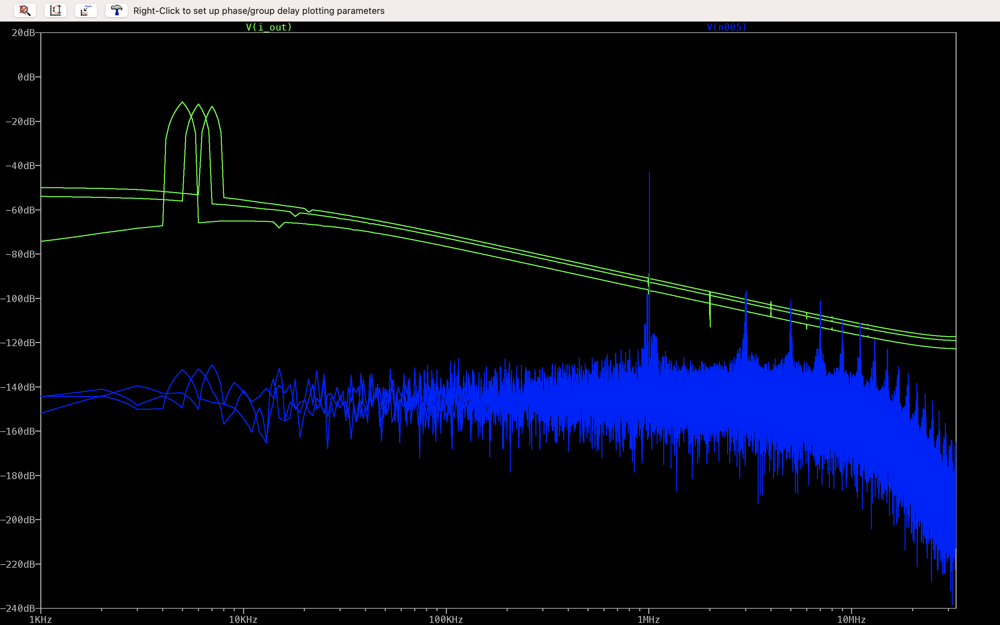

# Lab 3 - Amplifier and Tayloe Detector

This lab involves simulation and testing of an RF amplifier and  Tayloe detector.

## Part A - RF Amplifier 
### Question 1 - RF Amplifier Initial Simulation (30%)

The LTspice simulator is available from https://www.analog.com/en/design-center/design-tools-and-calculators/ltspice-simulator.html for both Windows and MacOS. Download and install the binary directly on your machine. 

[This schematic](sdr-2022.pdf) shows the RF amplifier with input RFIN and output RFOUT. Draw an LTspice schematic of the circuit using the ideal single-pole operational amplifier model in place of the THS4304. Make a Bode plot of the frequency response, using ```.ac dec 20 1 10MEG``` (this specifies an AC analysis with 20 points per decade from 1 Hz to 10 MHz). Find the datasheet for the [THS4304](https://www.ti.com/product/THS4304). What are typical values for the open loop gain and the gain bandwidth product? Change your opamp model to use these values in place of the default ones for Aol and GBW. How does the frequency response of your feedback RF amplifier change? Explain the reason that this happens. Also verify that the gain of the amplifier in the passband region around 7 MHz is the correct value.

### Question 2 - Measurement (70%)
Now measure the frequency response of the amplifier on your PCB using a waveform generator and oscilloscope. What is the small-signal gain for an approximately 100 mV peak-to-peak sine wave input at 4.001 MHz (unfortunately, although our amplifier should be designed for 7~MHz, the signal generators in the lab only work down to 5 MHz so we will use this value)? Is it the expected value?

## Part B - Tayloe Detector 
### Question 1 - Tayloe Detector Measurement (70%)

The Tayloe Detector simulation explained in the lectures is available in this directory as ```tayloe-ideal.asc```. 
Referring to the documentation, explain the purpose of the LTspice directive:
```
.step param FRQ 1005k 1007k 1k
```
in the simulation.

Run the simulation and display the voltage of nodes I_out and Q_out in a plot. Now modify the simulation so it operates at a carrier frequency of 4 MHz (i.e. the 4-phase clocks should operate at 4 MHz rather than 1 MHz) and downconverts the following input signal
```
.step param FRQ 4005k 4007k 1k
```
Place these new plots in your lab book and explain how they relate to the input signal created by V1. Also try View->FFT to obtain a frequency domain plot of V(I_out) and the input, V(n005) as shown below.



Now test your PCB by using a function generator with sine wave inputs at 4.005 MHz, 4.006 MHz and 4.007 MHz and show that it can mix with a carrier of 4 MHz to achieve outputs at 5, 6 and 7 kHz. To do this you will need to reprogram your Si5351 to have a 4 MHz output. Describe the expected behaviour in your lab book and include screen shots to demonstrate that it was achieved. 

*Note that the reason we use a 4 MHz carrier below is that the signal generators in the lab do not go up to 7 MHz. For WSPR, we need 7 MHz but are testing at 4 MHz to get around the limitations of the signal generator.*

### Question 2 - Tayloe Detector LTSpice Simulation (30%)

The initial simulation provided is for a simulation at 1 MHz. WSPR transmits a 4-FSK message. Change the simulation so fc=7.0386 MHz and FRQ will step from 7.04010 MHz over the exact range of values of a legal WSPR transmission (i.e. 4-FSK with a 1.4648 Hz tone separation). Make an fft plot of I_out and n005 similar to the one above. Explain the changes you made in your lab book. Note that I have had issues with LTSpice on the M1 Mac crashing but found that I could get it to work by changing the ```.step param FRQ``` command.
