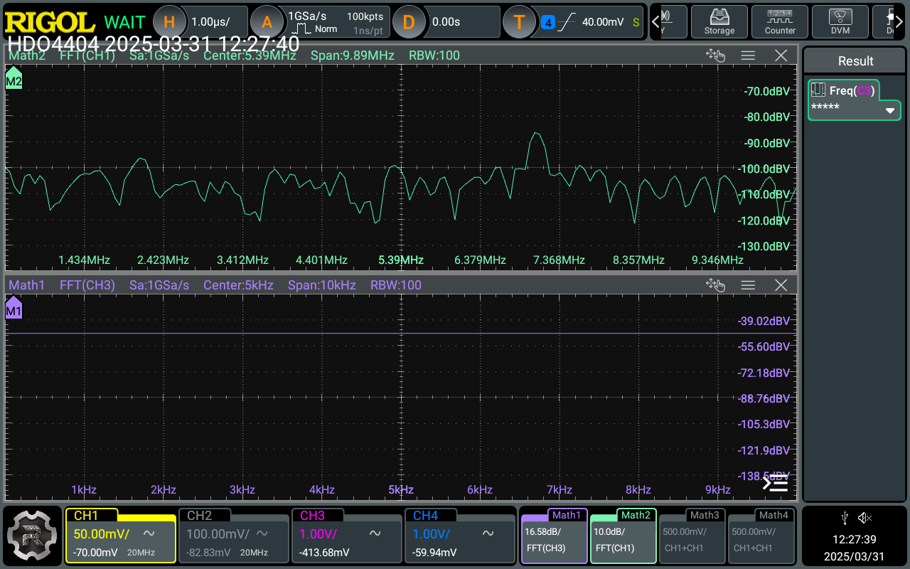

# Lab 3 - Amplifier and Tayloe Detector

This lab involves simulation and testing of an RF amplifier and  Tayloe detector.

## Part A - RF Amplifier 
### Question 1 - RF Amplifier Initial Simulation (30%)

The LTspice simulator is available from https://www.analog.com/en/design-center/design-tools-and-calculators/ltspice-simulator.html for both Windows and MacOS. Download and install the binary directly on your machine. 

A subcircuit of the schematic from the previous lab shows the RF amplifier with input RFIN and output RFOUT. Draw an LTspice schematic of the circuit using the ideal single-pole operational amplifier model (``opamp'') in place of the THS4304. Make a Bode plot of the frequency response, using ```.ac dec 20 1 10MEG``` (this specifies an AC analysis with 20 points per decade from 1 Hz to 10 MHz). Find the datasheet for the [THS4304](https://www.ti.com/product/THS4304). What are typical values for the open loop gain and the gain bandwidth product? Change your opamp model to use these values in place of the default ones for Aol and GBW. How does the frequency response of your feedback RF amplifier change? Explain the reason that this happens. Also verify that the gain of the amplifier in the passband region around 7 MHz is the correct value.

### Question 2 - Measurement (70%)
Now measure the frequency response of the RF amplifier on your PCB using a waveform generator and oscilloscope. What is the small-signal gain for an approximately 20 mV peak-to-peak sine wave input at 7.001 MHz? Is it the expected value?

## Part B - Tayloe Detector 
### Question 1 - Tayloe Detector Simulation (30%)

The Tayloe Detector simulation explained in the lectures is available in this directory as ```tayloe-ideal.asc```. 
Referring to the documentation, explain the purpose of the LTspice directive:
```
.step param FRQ 1005k 1007k 1k
```
in the simulation.

Run the simulation and display the voltage of nodes I_out and Q_out in a plot. Now modify the simulation so it operates at a carrier frequency of 7 MHz (i.e. the 4-phase clocks should operate at 7 MHz rather than 1 MHz) and downconverts the following input signal
```
.step param FRQ 7005k 7007k 1k
```
Place these new plots in your lab book and explain how they relate to the input signal created by V1. Also try View->FFT to obtain a frequency domain plot of V(I_out) and the input, V(n005) as shown below.


The initial simulation provided is for a simulation at 1 MHz. WSPR transmits a 4-FSK message. Change the simulation so fc=7.0386 MHz and FRQ will step from 7.04010 MHz over the exact range of values of a legal WSPR transmission (i.e. 4-FSK with a 1.4648 Hz tone separation). Make an fft plot of I_out and n005 similar to the one above. Explain the changes you made in your lab book. Note that I have had issues with LTSpice on the M1 Mac crashing but found that I could get it to work by changing the ```.step param FRQ``` command.

### Question 2 - Tayloe Detector Measurement (40%)

Now test your PCB by using a function generator with sine wave inputs to MIXIN at 7.005 MHz, 7.006 MHz and 7.007 MHz and show that it can mix with a carrier of 7 MHz to achieve baseband outputs at 5, 6 and 7 kHz on Qout. To do this you will need to reprogram your Si5351 to have a 7 MHz output. 
Describe the expected behaviour in your lab book and include screen shots to demonstrate what you measured. The  screen shots should include:
 * The MIXCLK0 and MIXCLK90 inputs to the mixer
 * The differential MIXQ+ and MIXQ- outputs of the mixer
 * The Qout output of the opamp integrator.
Unfortunately, a subset of the MIXQ+, MIXQ-, MIXI+ and MIXI-, I+, I-, Q+, Q- outputs have been mislabelled. Starting 
from the MIXCLK0 and MIXCLK90 inputs, explain the operation of the Tayloe detector circuit and write the correct labels 
in your lab book. Explain why the existing connections still work.

Using attenuators to reduce the output of the signal generator, measure the minimum discernable signal (MDS) 
from RFIN, through the RF amplifier and Tayloe detector to Qout. To do this, you can use the FFT math feature of the
oscilloscope to determine when the baseband output disappears below the noise.

Here is an oscilloscope capture of the input signal from the signal generator (RFIN), just above the noise floor. The signal generator was set to approx 30 mV and 2x 20dB attenuators inserted in the path.


Here is an oscilloscope capture of the downconverted, baseband signal (Iout), which can be seen around 2 kHz. 


### Question 3 - Iout Signal (30%)
Measure the transfer function of the Iout signal. You will note that it is not the same as Qout. Modify the printed circuit board (PCB) to fix this issue (by current a track and adding a new wire). Include a photograph of your modified PCB and an oscilloscope trace of the transfer function for both signals in your lab book. 

If this is done correctly, if you put the X-channel on Iout, Y-channel on Qout and set the oscilloscope to XY display, you should see the below. Explain why we get this output.


