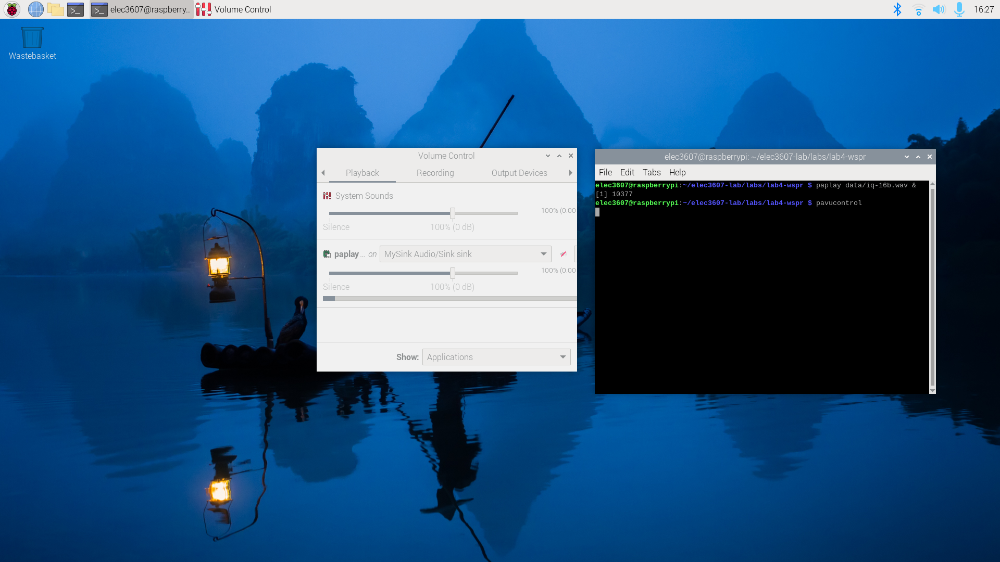

# SDR Software
This lab involves installing software defined radio (SDR) software on the RPi including
 * pulseaudio, a library which will allow you to access the audio features of Linux
 * the wspr decoder

First cd to your ```elec3607-lab``` directory and type ```git pull``` to ensure you have the latest version of the lab. Then update apt and install ```pavucontrol```.
```bash
elec3607@raspberrypi:~/elec3607-lab/labs/lab4-wspr $ sudo apt update
Hit:1 http://deb.debian.org/debian bookworm InRelease
Hit:2 http://deb.debian.org/debian-security bookworm-security InRelease
Hit:3 http://deb.debian.org/debian bookworm-updates InRelease                  
Hit:4 http://archive.raspberrypi.com/debian bookworm InRelease                 
Reading package lists... Done
Building dependency tree... Done
Reading state information... Done
139 packages can be upgraded. Run 'apt list --upgradable' to see them.
elec3607@raspberrypi:~/elec3607-lab/labs/lab4-wspr $ sudo apt install pavucontrol
Reading package lists... Done
Building dependency tree... Done
Reading state information... Done
The following packages were automatically installed and are no longer required:
  catch2 libcppunit-1.15-0 libcppunit-dev libeigen3-dev libfmt-dev libglfw3
  libgmp-dev libgmpxx4ldbl libgnuradio-fosphor3.9.0 libgsm1-dev
  libraspberrypi0 libspdlog-dev libthrift-dev pybind11-dev
Use 'sudo apt autoremove' to remove them.
The following additional packages will be installed:
  libcanberra-gtk3-0 libcanberra-gtk3-module libcanberra0
  libpulse-mainloop-glib0 sound-theme-freedesktop
Suggested packages:
  libcanberra-gtk0 libcanberra-pulse
The following NEW packages will be installed:
  libcanberra-gtk3-0 libcanberra-gtk3-module libcanberra0
  libpulse-mainloop-glib0 pavucontrol sound-theme-freedesktop
0 upgraded, 6 newly installed, 0 to remove and 139 not upgraded.
Need to get 641 kB of archives.
After this operation, 2,131 kB of additional disk space will be used.
Do you want to continue? [Y/n] 
Get:1 http://deb.debian.org/debian bookworm/main arm64 sound-theme-freedesktop all 0.8-2 [384 kB]
Get:2 http://deb.debian.org/debian bookworm/main arm64 libcanberra0 arm64 0.30-10 [38.3 kB]
Get:3 http://deb.debian.org/debian bookworm/main arm64 libcanberra-gtk3-0 arm64 0.30-10 [12.3 kB]
Get:4 http://deb.debian.org/debian bookworm/main arm64 libcanberra-gtk3-module arm64 0.30-10 [14.2 kB]
Get:5 http://deb.debian.org/debian bookworm/main arm64 pavucontrol arm64 5.0-2 [166 kB]
Get:6 http://archive.raspberrypi.com/debian bookworm/main arm64 libpulse-mainloop-glib0 arm64 16.1+dfsg1-2+rpt1 [26.8 kB]
Fetched 641 kB in 1s (565 kB/s)                   
Selecting previously unselected package sound-theme-freedesktop.
(Reading database ... 197408 files and directories currently installed.)
Preparing to unpack .../0-sound-theme-freedesktop_0.8-2_all.deb ...
Unpacking sound-theme-freedesktop (0.8-2) ...
Selecting previously unselected package libcanberra0:arm64.
Preparing to unpack .../1-libcanberra0_0.30-10_arm64.deb ...
Unpacking libcanberra0:arm64 (0.30-10) ...
Selecting previously unselected package libcanberra-gtk3-0:arm64.
Preparing to unpack .../2-libcanberra-gtk3-0_0.30-10_arm64.deb ...
Unpacking libcanberra-gtk3-0:arm64 (0.30-10) ...
Selecting previously unselected package libcanberra-gtk3-module:arm64.
Preparing to unpack .../3-libcanberra-gtk3-module_0.30-10_arm64.deb ...
Unpacking libcanberra-gtk3-module:arm64 (0.30-10) ...
Selecting previously unselected package libpulse-mainloop-glib0:arm64.
Preparing to unpack .../4-libpulse-mainloop-glib0_16.1+dfsg1-2+rpt1_arm64.deb ..
.
Unpacking libpulse-mainloop-glib0:arm64 (16.1+dfsg1-2+rpt1) ...
Selecting previously unselected package pavucontrol.
Preparing to unpack .../5-pavucontrol_5.0-2_arm64.deb ...
Unpacking pavucontrol (5.0-2) ...
Setting up libpulse-mainloop-glib0:arm64 (16.1+dfsg1-2+rpt1) ...
Setting up sound-theme-freedesktop (0.8-2) ...
Setting up libcanberra0:arm64 (0.30-10) ...
Setting up libcanberra-gtk3-0:arm64 (0.30-10) ...
Setting up libcanberra-gtk3-module:arm64 (0.30-10) ...
Setting up pavucontrol (5.0-2) ...
Processing triggers for libc-bin (2.36-9+rpt2+deb12u4) ...
Processing triggers for man-db (2.11.2-2) ...
Processing triggers for mailcap (3.70+nmu1) ...
Processing triggers for desktop-file-utils (0.26-1) ...
Processing triggers for gnome-menus (3.36.0-1.1) ...
```
## Question 1 -  Pulseaudio (60\%)

Plug in your USB sound card. It should appear if you type the following:
```bash
elec3607@raspberrypi:~/elec3607-lab/labs/lab4-wspr $ aplay -l
**** List of PLAYBACK Hardware Devices ****
card 0: vc4hdmi0 [vc4-hdmi-0], device 0: MAI PCM i2s-hifi-0 [MAI PCM i2s-hifi-0]
  Subdevices: 1/1
  Subdevice #0: subdevice #0
card 1: vc4hdmi1 [vc4-hdmi-1], device 0: MAI PCM i2s-hifi-0 [MAI PCM i2s-hifi-0]
  Subdevices: 1/1
  Subdevice #0: subdevice #0
card 2: Headphones [bcm2835 Headphones], device 0: bcm2835 Headphones [bcm2835 Headphones]
  Subdevices: 8/8
  Subdevice #0: subdevice #0
  Subdevice #1: subdevice #1
  Subdevice #2: subdevice #2
  Subdevice #3: subdevice #3
  Subdevice #4: subdevice #4
  Subdevice #5: subdevice #5
  Subdevice #6: subdevice #6
  Subdevice #7: subdevice #7
card 3: Device [Plugable USB Audio Device], device 0: USB Audio [USB Audio]
  Subdevices: 1/1
  Subdevice #0: subdevice #0
```

You can also check that pulseaudio is working:
```
elec3607@raspberrypi:~/elec3607-lab/labs/lab4-wspr $ pactl list short
1	libpipewire-module-rt	{
            nice.level    = -11
            #rt.prio      = 88
            #rt.time.soft = -1
            #rt.time.hard = -1
        }	
2	libpipewire-module-protocol-native		
3	libpipewire-module-profiler		
5	libpipewire-module-metadata		
7	libpipewire-module-spa-device-factory		
9	libpipewire-module-spa-node-factory		
11	libpipewire-module-client-node		
13	libpipewire-module-client-device		
15	libpipewire-module-portal		
16	libpipewire-module-access	{
            # access.allowed to list an array of paths of allowed
            # apps.
            #access.allowed = [
            #    /usr/bin/pipewire-media-session
            #]

            # An array of rejected paths.
            #access.rejected = [ ]

            # An array of paths with restricted access.
            #access.restricted = [ ]

            # Anything not in the above lists gets assigned the
            # access.force permission.
            #access.force = flatpak
        }	
17	libpipewire-module-adapter		
19	libpipewire-module-link-factory		
21	libpipewire-module-session-manager		
536870912	module-always-sink		
67	alsa_output.usb-Plugable_Plugable_USB_Audio_Device_000000000000-00.analog-stereo	PipeWire	s16le 2ch 48000Hz	IDLE
69	alsa_output.platform-bcm2835_audio.stereo-fallback	PipeWire	s16le 2ch 48000Hz	IDLE
70	alsa_output.platform-fef00700.hdmi.hdmi-stereo	PipeWire	s32le 2ch 48000Hz	IDLE
67	alsa_output.usb-Plugable_Plugable_USB_Audio_Device_000000000000-00.analog-stereo.monitor	PipeWire	s16le 2ch 48000Hz	RUNNING
68	alsa_input.usb-Plugable_Plugable_USB_Audio_Device_000000000000-00.analog-stereo	PipeWire	s16le 2ch 48000Hz	RUNNING
69	alsa_output.platform-bcm2835_audio.stereo-fallback.monitor	PipeWire	s16le 2ch 48000HzRUNNING
70	alsa_output.platform-fef00700.hdmi.hdmi-stereo.monitor	PipeWire	s32le 2ch 48000Hz	RUNNING
93	67	92	PipeWire	float32le 1ch 25Hz
94	68	92	PipeWire	float32le 1ch 25Hz
95	69	92	PipeWire	float32le 1ch 25Hz
96	70	92	PipeWire	float32le 1ch 25Hz
31	PipeWire	xdg-desktop-portal
32	PipeWire	wf-panel-pi
33	PipeWire	wireplumber
34	PipeWire	wireplumber
40	PipeWire	xdg-desktop-portal-wlr
92	PipeWire	pavucontrol
141	PipeWire	pactl
55	alsa_card.usb-Plugable_Plugable_USB_Audio_Device_000000000000-00	alsa
56	alsa_card.platform-bcm2835_audio	alsa
57	alsa_card.platform-fef00700.hdmi	alsa
58	alsa_card.platform-fef05700.hdmi	alsa
```

You should now be able to play a file using ```paplay``` and display the level textually with ```pavucontrol``` like in the figure below.




## Question 4 (Optional) - SoapySDR and quisk (30\%)

Quisk is a software defined radio software program. It uses the SoapySDR library as the interface to the radio. In this part of the lab, don't use the apt installer as the excercise is to compile the code from source.

First install SoapySDR by following these instructions: <https://github.com/pothosware/SoapySDR/wiki#installation>

Then install the Python 3 version of quisk: <https://james.ahlstrom.name/quisk/>

Once you have done this, you can execute quisk. Under Linux desktop, a window with the quisk software should appear. Quisk will be a useful tool for debugging your radio. Configure this program so that it can graphically display the output of a file played using ```paplay```.


