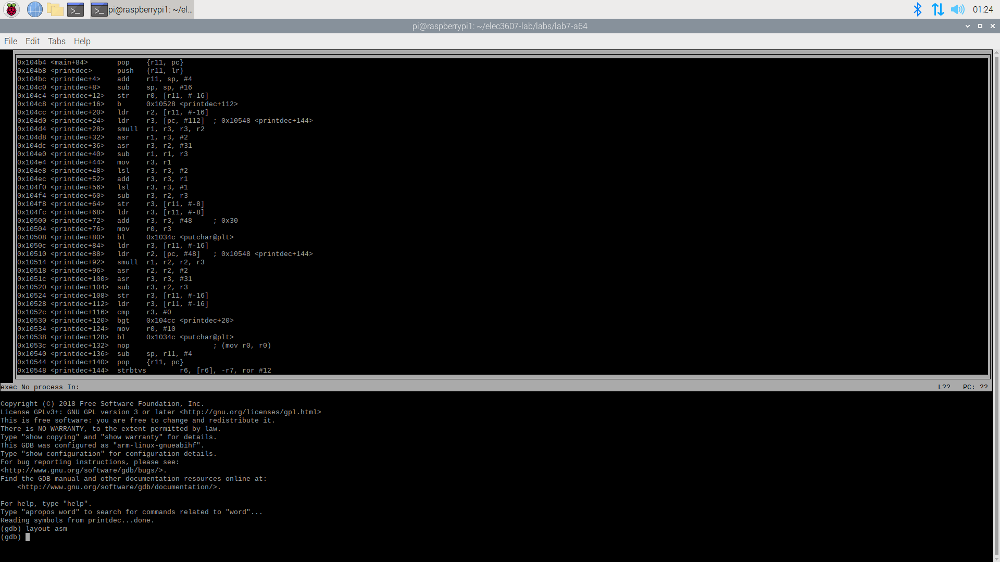

# A64 Assembly Language (Stack Frames and Function Calls)

## Introduction
The goals of this lab are:

    * Practise writing A64 assembly language
    * Learn to use the gdb debugger
    * Understand stack frames and function calls

ARM Linux will be used for this lab. Refer to [Learn the architecture - A64 Instruction Set Architecture Guide](https://developer.arm.com/documentation/102374/0101) for information ob the A64 instruction set architecture. 

The following C program, printdec, prints the decimal value of 10 random numbers.

```C
#include <stdio.h>
#include <stdlib.h>

void
printdec(int n)
{
    while (n > 0)
    {
        int c = n % 10;
        putchar(c + '0');
        n /= 10;
    }
    putchar('\n');
}

int
main()
{
    srand(0);
    for (int i = 0; i < 10; i++)
    {
        int r = rand();

        printdec(r);
    }
    return 0;
}
```

The supplied copy of the program is split into 2 files, ```main.c``` and ```printdec.c```.
It can be compiled the commands below. Note how ```printdec.c``` is first compiled to ```printdec.s``` (using ```gcc -S printdec.c``` and then assembled to ```printdec.o``` (using as -o printdec.o printdec.s). For main.c, this is done in one step because we are not interested in the assembly language output.

```bash
$ make
gcc    -c -o main.o main.c
gcc -S  printdec.c
as -o printdec.o printdec.s
gcc -o printdec main.o printdec.o
```

It is executed as follows:
```bash
$ make
$ ./printdec 
3839824081
688039648
7772961861
5196364171
3977477591
533832424
683588917
2940679461
946615695
1241469811
```

## Lab Questions

In your
answers, make sure that your assembly language code is clearly commented.

### Part 0 - Student Survey (additional 10%)
Please complete this survey <https://student-surveys.sydney.edu.au/students/> and provide evidence to the tutors. We will give a 10% bonus mark.
See [uss_slide.pdf](https://github.com/phwl/elec3607-lab/blob/main/labs/lab7-a64/USS_slide.pdf) for more info.

### Part 1 - Annotated printdec.s (30%)
You can see the assembly language generated by the C compiler as follows.
```as
% cat printdec.s
	.section	.note.GNU-stack,"",%progbits
	.arch armv8-a
	.file	"printdec.c"
	.text
.Ltext0:
	.file 0 "/home/elec3607/elec3607-lab/labs/lab7-a64" "printdec.c"
	.align	2
	.global	printdec
	.type	printdec, %function
printdec:
.LFB0:
	.file 1 "printdec.c"
	.loc 1 5 1
	.cfi_startproc
	stp	x29, x30, [sp, -48]!
	.cfi_def_cfa_offset 48
	.cfi_offset 29, -48
	.cfi_offset 30, -40
	mov	x29, sp
	str	w0, [sp, 28]
	.loc 1 6 11
	b	.L2
.L3:
.LBB2:
	.loc 1 8 13
	ldr	w1, [sp, 28]
	mov	w0, 26215
	movk	w0, 0x6666, lsl 16
	smull	x0, w1, w0
	lsr	x0, x0, 32
	asr	w2, w0, 2
	asr	w0, w1, 31
	sub	w2, w2, w0
	mov	w0, w2
	lsl	w0, w0, 2
	add	w0, w0, w2
	lsl	w0, w0, 1
	sub	w0, w1, w0
	str	w0, [sp, 44]
	.loc 1 9 9
	ldr	w0, [sp, 44]
	add	w0, w0, 48
	bl	putchar
	.loc 1 10 11
	ldr	w0, [sp, 28]
	mov	w1, 26215
	movk	w1, 0x6666, lsl 16
	smull	x1, w0, w1
	lsr	x1, x1, 32
	asr	w1, w1, 2
	asr	w0, w0, 31
	sub	w0, w1, w0
	str	w0, [sp, 28]
.L2:
.LBE2:
	.loc 1 6 14
	ldr	w0, [sp, 28]
	cmp	w0, 0
	bgt	.L3
	.loc 1 12 5
	mov	w0, 10
	bl	putchar
	.loc 1 13 1
	nop
	ldp	x29, x30, [sp], 48
	.cfi_restore 30
	.cfi_restore 29
	.cfi_def_cfa_offset 0
	ret
	.cfi_endproc
.LFE0:
	.size	printdec, .-printdec
.Letext0:

	; ...
	; debug stuff deleted
```

Using gdb ([manual here](https://sourceware.org/gdb/current/onlinedocs/gdb.html/index.html#Top)), also look at the TUI inteface section), put a breakpoint just before the call to printdec (```bl _printdec```) and display the value of the ```r``` variable. 
Single step the assembly language using gdb with the ```nexti``` command
and understand the operation of the program. Show the sequence of commands that you need in gdb to step ```_printdec``` and display the register values.



Note, the code that computes  ```n % 10``` and ```n / 10``` is really tricky. You don't need to annotate that in your answer (but can do so for extra credit in
Part 4).

Create an annotated version of ```printdec.s```. Put this in your lab book and make sure you explain the correspondence with each line of C. You can remove the .cfi and .loc directives in your answer as these are used to help the debugger relate the code back to the original C.

### Part 2 - Assembly Language version of printdec (40%)
When doing this exercise, it is unlikely your program will work first time so use the single step and register display facilities in gdb to debug your work. Note that you solution must be hand-written assembly language - we can tell the difference!

Note that _printdec uses the frame pointer for temporary variables. Rewrite in A64 assembly language using registers.

### Part 3 - Assembly Language version of printdec (30%)
From Part 2, you should have noticed that printdec() prints the string in the reverse order. Modify your assembly language program to fix this bug. Do this by buffering the data inside printdec() and then printing out the buffer in reverse.  
Hint: it might be easier to do it in C first, study the generated assembly code and then write your own version.

### Part 4 - Optional (20%)
This part gives you the opportunity to get bonus marks and very challenging. Annotate the
part that computes ```n % 10``` and ```n / 10``` giving a clear description of what it is doing.
